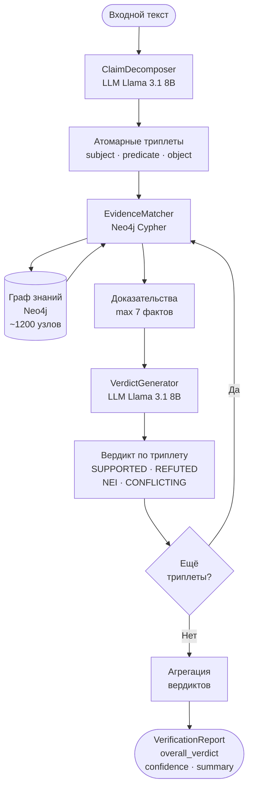
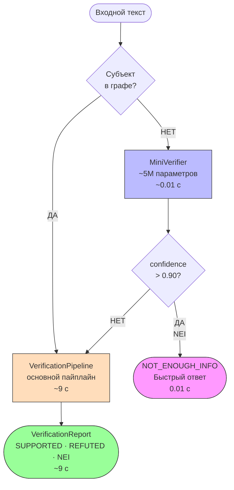

# Система верификации фактов на основе GraphRAG

## Описание
Автоматическая верификация текстовых утверждений 
с использованием графа знаний Wikidata и LLM Llama 3.

## Архитектура
- ClaimDecomposer — декомпозиция через LLM
- EvidenceMatcher — поиск в Neo4j
- VerdictGenerator — вердикт через LLM
- MiniVerifier — быстрый фильтр (~5M параметров)

## Результаты
| Модель       | Accuracy | Macro F1 | Время |
|--------------|----------|----------|-------|
| Ollama 8B    | 78.5%    | 79.1%    | 9.07с |
| MiniVerifier | 48.1%    | 41.6%    | 0.01с |
| Каскад       | 78.5%    | 79.1%    | 2.80с |

## Запуск
```bash
docker-compose up -d    # Neo4j
ollama serve            # LLM
python main.py          # API
'''

## Основной пайплайн



## Каскадный пайплайн

